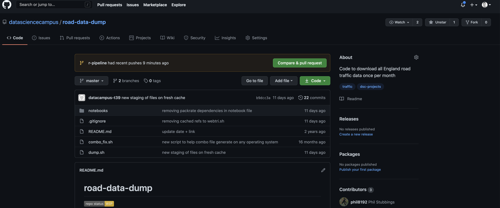
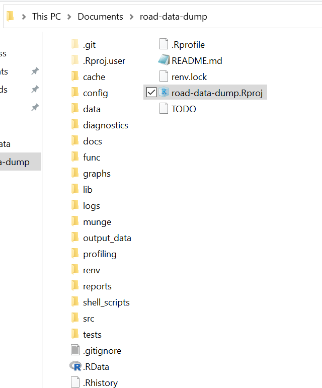

```{r, include=FALSE}
knitr::opts_chunk$set(echo = TRUE)
htmltools::tagList(rmarkdown::html_dependency_font_awesome())

```


# Introduction

The **Road Data Pipeline** is an unofficial [Highways England WebTRIS api](https://webtris.highwaysengland.co.uk/api/swagger/ui/index) client. The work contained within the pipeline was built upon the work done by [phil8192's webtri.sh client](https://github.com/phil8192/webtri.sh). This pipeline is less flexible than the webtri.sh client acknowledged above, but includes additional data processing, outputting csv files for the user-specified date range.


The client allows querying of **all available sites** for **specified date ranges**, intended for monthly analysis. 

## Output Summary

+-------------------+----------------+--------------------------------------------+
|Column             |Values          |Description                                 |
+===================+================+============================================+
|Site Name          |Alphanumeric    |Long-form site code                         |
+-------------------+----------------+--------------------------------------------+
|Report Date        |Datetime        |The date of data capture                    |
+-------------------+----------------+--------------------------------------------+
|Time Period Ending |Timestamp       |The time of data capture                    |
+-------------------+----------------+--------------------------------------------+
|Time Interval      |Integer         |Pending                                     |
+-------------------+----------------+--------------------------------------------+
|x - y cm           |Integer         |Multiple columns containing vehicle lengths |
+-------------------+----------------+--------------------------------------------+
|x - y mph          |Integer         |Multiple columns, Speed of vehicle          |
+-------------------+----------------+--------------------------------------------+
|Avg mph            |Integer         |Average speed of vehicle                    |
+-------------------+----------------+--------------------------------------------+
|Total Volume       |Integer         |Pending                                     |
+-------------------+----------------+--------------------------------------------+
|site_id            |Integer         |Numerical site code                         |
+-------------------+----------------+--------------------------------------------+
|sites.Description  |Factor          |Repeat of Site Name                         |
+-------------------+----------------+--------------------------------------------+
|sites.Longitude    |Floating Point  |Coordinate data                             |
+-------------------+----------------+--------------------------------------------+
|sites.Latitude     |Floating Point  |Coordinate data                             |
+-------------------+----------------+--------------------------------------------+
|sites.Status       |Character       |Active / inactive                           |
+-------------------+----------------+--------------------------------------------+
|type               |Character       |Site type: MIDAS, TAME or TMU               |
+-------------------+----------------+--------------------------------------------+
|direction          |Character       |Compass direction of traffic                |
+-------------------+----------------+--------------------------------------------+
|easting            |Integer         |Coordinate data                             |
+-------------------+----------------+--------------------------------------------+
|northing           |Integer         |Coordinate data                             |
+-------------------+----------------+--------------------------------------------+

The output files will appear in the **output_data** folder as **site-type_query-date.csv**. There are 3 site types available, **MIDAS**, **TAME**, and **TMU**. Please see explanations of the different site types, as provided by phil8192:

<div class="quote">
  <ol>
    <li>Motorway Incident Detection and Automatic Signalling (MIDAS)
     Predominantly inductive loops (though there are a few sites where radar
     technology is being trialled)</li>
    <li> TAME (Traffic Appraisal, Modelling and Economics) which are inductive loops</li>
    <li> Traffic Monitoring Units (TMU) (loops)</li>
    <li> Highways Agency’s Traffic Flow Database System (TRADS)
     Traffic Accident Database System (TRADS)? (legacy)</li>
  </ol>
</div>
   
Note that TRADS is available but not being queried by this pipeline.

***

## Dependencies

* R Studio
* R (64-bit)
* 20 GB of free disk space to allocate
* Internet connection (preferably high speed fiber optic)
* Access to CRAN packages listed below.
* Git
* GitHub account
* Command line interface (Bash, Terminal, CMD prompt etc)

### Packages and versions:

* rlist 0.4.6.1
* this.path 0.2.0
* stackoverflow 0.7.0
* dplyr 1.0.2          
* jsonlite 1.7.1
* httr 1.4.2
* log4r 0.3.2
* renv 0.12.3          
* beepr 1.3
* stringr 1.4.0
* purrr 0.3.4
* data.table 1.13.2    
* ProjectTemplate 0.9.3

### Notes

1. Memory allocation - 20GB of memory is requested for use in the R session. The script will stop execution if this is not available. 1 month of data tends to require approximately 10 to 11 GB of memory allocation to process.

2. Internet connection - 1 month of data takes approximately 1.25 hours on a connection averaging 60 mbps download, 20 mbps upload.

3. Package management - this project uses `renv` to manage package versions. Using `renv` to ensure package versions are consistent can help to minimise the risk of breaking changes.

***
***

## Download the Pipeline

To get a copy of the pipeline, you will need to download the repository from [DSC road data](https://github.com/datasciencecampus/road-data-dump).

Click on the `Code` button to see your download options.


***

To access the pipeline, you will currently need to `clone` this repository using **Git**. This will allow access to the branch that stores the required files.

It is recommended to specify **HTTPS** for cloning options, click on the clipboard icon to copy the required url.


***

Using Bash, CMD prompt, terminal or whatever command line interface you prefer to use for Git interfacing, navigate to the directory you wish to run the pipeline from and run the line:

`git clone https://github.com/datasciencecampus/road-data-dump.git`

If the clone is executed correctly, navigate to the newly cloned repository by running:

`cd road-data-dump`

Once you have arrived at the roads-data-dump folder, you will need to check out to the **r-pipeline** branch. In order to do that, run the line:

`git checkout r-pipeline`

If you successfully checked the **r-pipeline** out, you should now have a directory that looks like this:




If your directory looks like this, you are ready to begin first time configuration. Please proceed to [First Time Run](#firsttimerun). <a href="#firsttimerun">First Time Run</a>.

If you require additional support for running Git and the Git commands, then please refer to this [Towards Data Science Complete Beginner's Guide](https://towardsdatascience.com/getting-started-with-git-and-github-6fcd0f2d4ac6).

***
***

## Using the Pipeline

Some guidance before starting:

If you have any of the output data files open, I advise closing them prior to running the pipeline. If R tries to overwrite a file with the same name, it will error and halt execution. If this happens, close the file, use R Studio to open `munge/15-write.R` and re-run this script (either click on the `source` button at the top of the script in R Studio, or press `Ctrl` + `shift` + `enter`).

It is also best to start from a blank slate every time you run the pipeline. To do this, select `Session` > `Clear Workspace` from the toolbar at the top of R Studio.

<div class="summary-box">
Always ensure you are working from the R Project file. This help to ensure a consistent environment every time you run the pipeline.
</div>
<br>
The project file is called `road-data-dump.Rproj`.

<a id="#firsttimerun"></a>

### First Time Run

On your first run, you need to configure your R Studio set up and then test the pipeline.

#### Configuration

##### renv

The `renv` package helps to ensure the pipeline is using the same version of all packages every time it runs. This takes a little set up.

1. Ensure `renv` is installed by running: `install.packages("renv")`.

Successful installation should look something like this:
```
The downloaded binary packages are in
	/var/folders/d3/cjvn_l1n13z5z3t6nz554p8r0000gq/T//RtmpnEKjds/downloaded_packages
```
2. Once `renv` has been successfully installed, you will need to build a local package library for this pipeline. The packages will all have the required versions and this step will not affect your other R projects. to do this, execute the line: `renv::restore()`. 

You will be asked:

`Do you want to proceed? [y/N]: y`

Enter `y` and press enter.

This will go to CRAN for all the required package version dependencies. This may take some time. Keep a close eye on R Studio's console for any error warnings and note the packages that fail. Retry installing any package that failed by running `install.packages("insert_package_name")`. You can also try: `install.packages("insert_package_name, type = "win.binary", dependencies = TRUE)`.

3. Successful loading of required package versions will look like this:

```
The following package(s) have been updated:

	glue       [installed version 1.4.2  != loaded version 1.4.1 ]
	data.table [installed version 1.13.2 != loaded version 1.12.8]
	rlang      [installed version 0.4.9  != loaded version 0.4.8 ]
	generics   [installed version 0.1.0  != loaded version 0.0.2 ]
	magrittr   [installed version 2.0.1  != loaded version 1.5   ]
	vctrs      [installed version 0.3.5  != loaded version 0.3.1 ]
	pillar     [installed version 1.4.7  != loaded version 1.4.4 ]
	tibble     [installed version 3.0.4  != loaded version 3.0.1 ]
	dplyr      [installed version 1.0.2  != loaded version 1.0.0 ]
	renv       [installed version 0.12.3 != loaded version 0.12.2]
	stringi    [installed version 1.5.3  != loaded version 1.4.6 ]

Consider restarting the R session and loading the newly-installed packages.
```
Notice that the installed versions and loaded versions are different. This is what we want for the pipeline, we will be using the specified package versions instead of the most up to date version installed on our machine. 

Also note that I have been asked to restart R. If prompted, do this prior to running the pipeline. Select `Session` > `Restart R` from the menu at the top of R Studio.

4. Before moving on to the next section, check to ensure all the required packages have been installed correctly. Run this command again to ensure correct package versions: `renv::restore()`. If everything is good, the console should print:

```
* The library is already synchronized with the lockfile.
```

5. If this is not the case, hopefully the `restore` function would have gone ahead and brought the packages up to the required versions. If not, you will require support with `renv`, please contact me by clicking the mail icon. 

<div>
  <a href="mailto:richard.leyshon@ons.gov.uk">
    <i class="fas fa-envelope fa-2x" id="emailme"></i>
  </a>
</div>

<br>
<br>


##### ProjectTemplate


<div>
Using R Studio’s file browser, open run-me.R, which is found within the src folder.


Click on the run-me.R script once it has appeared in RStudio

==========Include test_me <- TRUE==========
On the first run, ensure test_run <- TRUE
This will execute the pipeline, but for one siteID and on one day.
If successful, you should hear a bleep. Also, the console will print

Time difference of 2.153 secs
INFO  [2020-12-14 12:52:49] #############End of pipeline#############


Run the scripts. If you see an error like this:
Error in .check.version(config) : 
  Your configuration is compatible with version 0.9.3 of the ProjectTemplate package.
  Please upgrade ProjectTemplate to version 0.9.3 or later

Then run `install.packages("ProjectTemplate”)`


If the test worked, you would have heard a jingle. You would then be able to overwrite with

</div>

#### Test Pipeline


### Subsequent Runs


## Error Handling

***
```
document error: Error in fwrite(tmu, "output_data/tmu.csv", row.names = F, quote = F) :
Permission denied: 'output_data/tmu.csv'. Failed to open existing file for writing. Do you have write permission to it? Is this Windows and does another process such as Excel have it
open?
```
This means R can't write to csv as the file is open. Please close any Excel files and re-run the pipeline.

***


test_run <- FALSE


==========Include specifying dates to query==========

In order to specify which dates to query, you will need to access 03-set_qury_parameters.R within the munge folder. The dates you will need to adjust appear as start_data and end_date, assign values as below:


start_date <- "01072019"


end_date <- "31072019"

Once you have entered your desired dates, return to the run-me.R script and run all.

==========Include output data==========

The output of the pipeline will be as follows:

./output_data/midas.csv
./output_data/tame.csv
./output_data/tmu.csv
./output_data/missing_site_IDs.txt
./logs/logfile.txt

The output data csvs contain the api output.
The missing_site_IDs.txt returns a sequence of missing site IDs form the queried date range, a count of api responses that were empty, and what proportion of the overall number of IDs queried this represented (rounded to 2dp).

Currently, executing the pipeline will overwrite any output_data files.

The log file.txt is important if you encounter an error. This document can be passed back to the developer in order to investigate issues encountered. New run s do not overwrite the logs, they append pre-existing logs.


